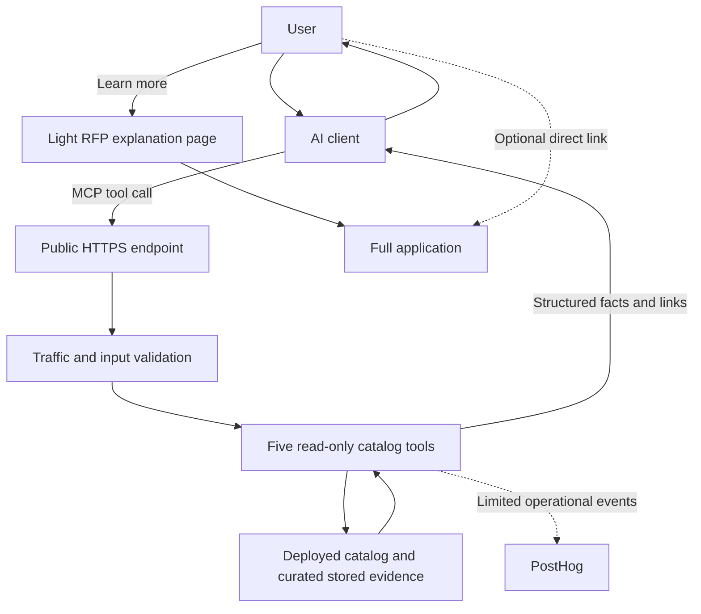
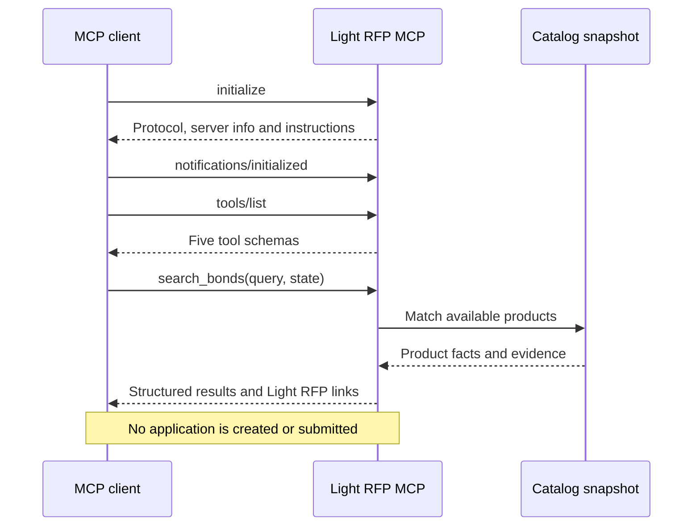

# Architecture and data flow

This companion repository documents a hosted service. It does not contain the private deployment implementation, full catalog, raw application forms, or a self-hosting package.



The catalog supplies product identifiers, availability, pricing rules, amount constraints and curated application evidence. Calculations run against the deployed snapshot. Generation of a new deployment does not by itself prove a new verification of every source fact.

## Request lifecycle



## Application workflow boundary

```text
MCP discovery                         Website/application workflow
------------------------------        ----------------------------
Search / details / catalog price
Preparation topics / links    ------> Explanation page
                                      Full application
                                      Required approvals
                                      Purchase / issuance when available
```

The user chooses whether to continue to the website. The MCP neither transfers an applicant profile nor prefills the application. Application, approval, payment and issuance steps happen in a separate workflow with its own disclosures.

## Operational measurement

Tool events help identify latency, errors, empty results and returned-link counts. These counts do not establish answer views, clicks or purchases. Hosting/security metadata and MCP analytics are separate from browser analytics on the website. See [data handling](privacy.md).
